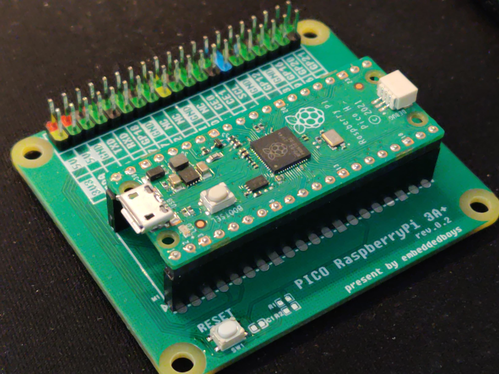

# Pico Raspberry Pi 3A+



This project is designed to be a straightforward alternative system for Raspberry Pi GPIO headers, offering pin-to-pin compatibility with the Raspberry Pi.

If you possess idle Raspberry Pi HATs, you can utilize this board to operate them.

## Before you start

### 1. Certain GPIOs may be unavailable.

GP23, 24, and 25 are not accessible on the Raspberry Pi Pico as they are not lead out.

On this board, They have been marked with the "NC" label.

### 2. The `pio_spi_tx` is enabled by default.

We have enabled it by default due to its superior performance compared to the SPI controller. This also means that the `pio0` block is used.

### 3. The UART TX has been reassigned to GPIO 14.

Why call it reassigned?

Well. The default debug UART on the Raspberry Pi is assigned to GPIO 14 and 15. However, on the Raspberry Pi Pico, GPIO 14 and 15 do not support UART functions. Therefore, we utilize a `uart_tx` PIO library to remap TX function to GPIO 14, and the `pio1` block is reserved for this library. If UART debug is not required, it can be disabled by setting the `UART_TX_ENABLE` macro to 0.

## Build

The default cmake settings is to build the `rpi_dm_yt350s006` Raspberry Pi Display HAT example.

Build for the Raspberry Pi Pico:
```bash
mkdir build && cd build
cmake .. -G Ninja
ninja && ls -lh src/rp2040-freertos-template.uf2
```

Build for the Raspberry Pi Pico2:
```bash
mkdir build_pico2 && cd build_pico2
cmake -DPICO_BOARD=pico2 .. -G Ninja
ninja && ls -lh src/rp2040-freertos-template.uf2
```

## Depoly

Hold down the BOOTSEL button on the Raspberry Pi Pico and connect it to your computer via USB.
```bash
cp src/rp2040-freertos-template.uf2 /media/$USER/RPI-RP2/
```